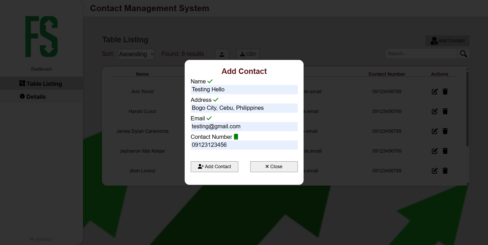

# Contact Management System
- By [Jayharron Mar Abejar](https://jayharronabejar.info) 😁
## Basic CRUD operations

### Fields
- Name
- Address
- Email
- Contact No.
### Landing Page:
##### Table Listing
- Detail
- Update
- Delete/Remove
- Search
- Add

### Details Page
- Entry | Update Form

UI Design Mockup [Figma Link](https://www.figma.com/file/2nCh6LhE1AuRX4FbOyE6CW/SCMS?type=design&node-id=0%3A1&t=seI1UG01ysWnRlIK-1)

# Tech Stack used
- ASP.NET C# 
- SqLite
- Entity Framework
- JavaScript & CSS
- [Leaflet](https://leafletjs.com/) (Interactive Maps)
- [Geoapify](https://www.geoapify.com/) (Map Geocoding)

# Documentation
Adding of contact UI

Viewing the Contact Details

